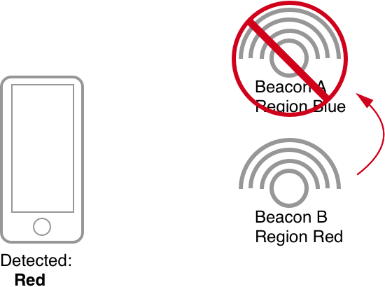

### Overview

This app supports a custom form of indoor location. This indoor location solution has these goals in mind:

1. Cross-platform support
2. Works offline (Everything happens clientside)
3. Cheap

Due to these goals most off the shelf indoor location solutions are out of consideration.

So a custom solution was developed. This solution only provides coarse indoor location tracking, e.g. knowing when a user enters a room but not *where* in that room the user is.

An overview of the system:

1. A beacon is assigned to a region
2. Multiple beacons can be assigned to a region
3. Objects are assigned to a region
4. Beacons may block other beacons
5. Multiple regions can be detected at a time

A beacon is a Bluetooth Low Energy (BLE) device that periodically sends out signals that are detected by the user's device. We then use these signals to figure out the user's location.

We also allow beacons to be assigned to block other beacons. This is particularly helpful when a user enters a threshold and we want to block their previous beacon.

The placement of beacons is key to the use of this system. Beacon placement is difficult for two reasons:

1. Radio waves can bounce and be absorbed by materials. (e.g. Radio waves bounce off concrete but are absorbed by cloth, etc.)
2. Radio waves distance scales logarithmically with the power. This means a slight increase in power can have dramatic effects in range.

To solve issue 2, we recommend keeping all beacons at the same power. To solve issue 1, we have created a tool to help quickly test the deployments of beacons and which beacons regions are detected:

[Beacon Deployment Tool](https://github.com/NordicMuseum/BeaconDeploymentTool)

The Beacons, their regions and which beacons they block are contained in a JSON document that can be found in the [app/data/beaconBlockRules.json file](../app/data/beaconBlockRules.json).

The code that accomplishes the blocking is in a [closeTourStops.js reducer](../app/reducers/closeTourStops.js).

### Scenarios

To better explain beacon blocking, let us walk through a few scenarios.

#### Scenario 1

In this scenario, only one beacon is detected, so the region of the beacon is shown on the device.

#### Scenario 2

In this scenario, two beacons are detected. Neither of them block each other so both of the beacon's regions are shown on the device.

#### Scenario 3

In this scenario, two beacons are detected. Beacon B blocks Beacon A so only Beacon B's region is shown on the device.

### FAQ

Q. What type of BLE beacons work?  
A. Any beacon that supports the iBeacon standard will work. We have tested and deployed both [Estimote](https://estimote.com/products/) and [Kontakt](https://kontakt.io) beacons.

Q. Why are objects placed on regions and not just beacons?  
A. We want to abstract the idea that beacons are behind this system as much as possible. This allows people to talk about regions when placing objects without having to know about the devices powering this solution.

Q. What happens if all the beacons detected block each other so no region is shown to the user?   
A. In graph theory that is called a cycle. We detect if blocking a beacon might create a cycle and prevent you from creating that block in the [Beacon Deployment Tool](https://github.com/NordicMuseum/BeaconDeploymentTool).
